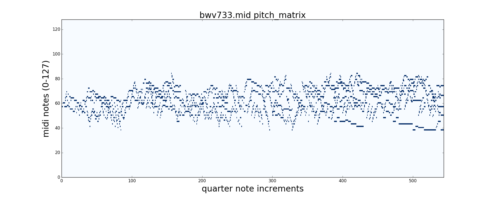
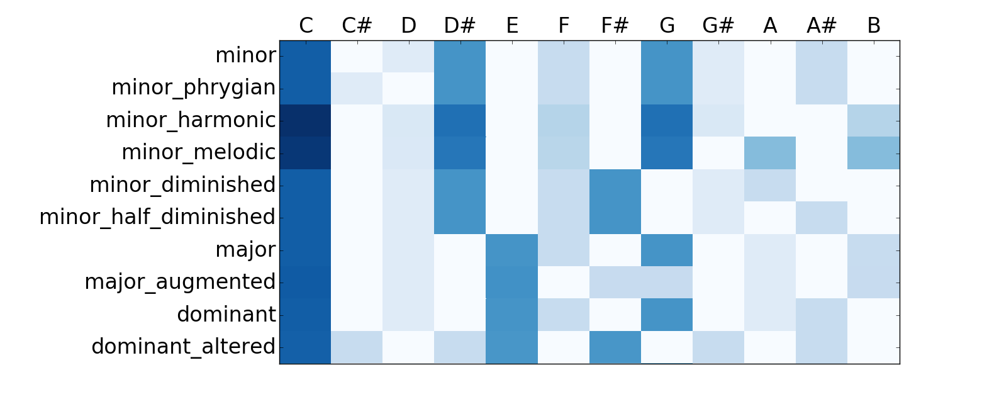
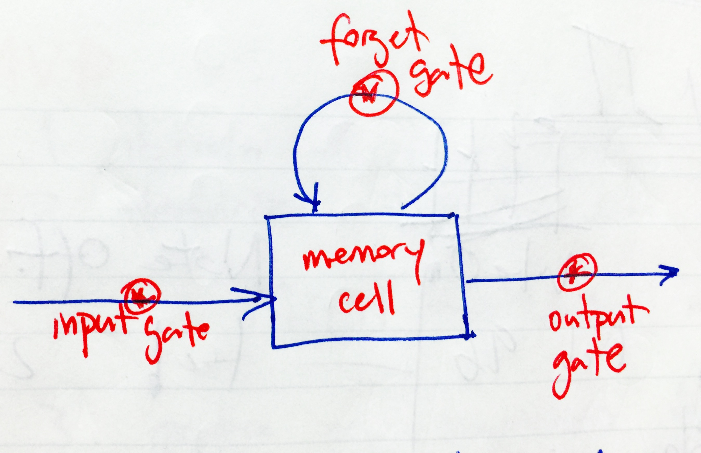
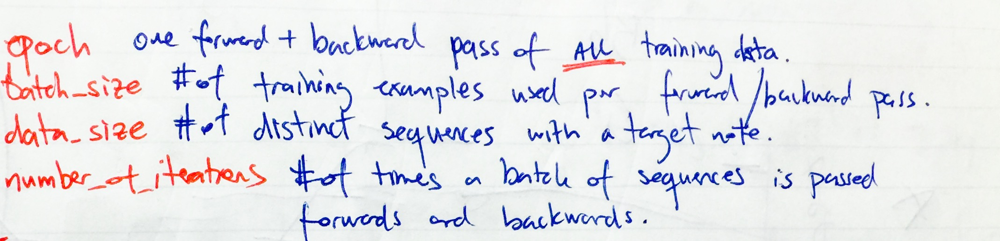
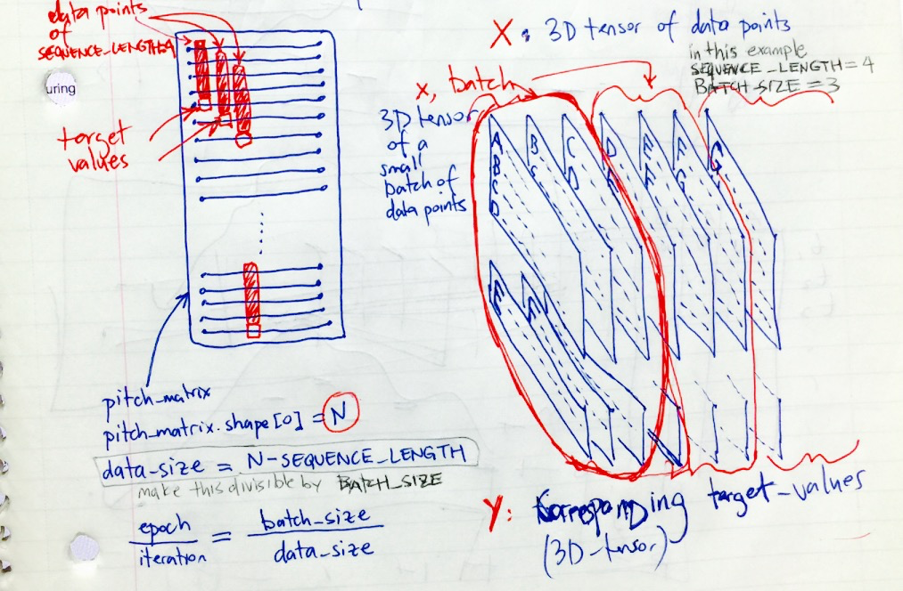

 =100>*<sup>The following is a project development daily journ =100x20al.
It comprises of notes, thoughts and findings accompanying my work.
It is to be replaced by a proper README file at the end of the project. </sup>*

---

##### *June 19, 2016 - Sunday*

Believe it or not, I accidentally ran `rm -rf /*` on my computer when i wanted to type
`rm -rf ./*`!!!.

I stopped the deletion  when it was going thru `Applications/Evernote.app` directory. 
It was throwing `Permission denied` errors all over the place. 
But, it deleted Ableton Live and all my instrument patches. 
I ended up having to download Ableton from their website. 
It was easy because I registered it when I bought it. 
I'll have to re-install the patches some other time. 
I hope this is the whole extent of the damage.

---

Deleting .DS_Store remotely on git repo:
```javascript
find . -name ".DS_Store" -exec git rm --cached -f {} \;.
git commit -m "delete files"
git push
```
---

**Python MIDI**

[python MIDI github.com/vishnubob](https://github.com/vishnubob/python-midi)  
Python, for all its amazing ability out of the box, 
does not provide you with an easy means to manipulate
MIDI data.

[markdown cheatsheet](https://github.com/adam-p/markdown-here/wiki/Markdown-Cheatsheet)

[Andrej Karpathy github.com](https://github.com/karpathy/char-rnn)

---
**MIDI PYTHON**
Midi keyboard offers 128 keys (0 thru 127), whereas a piano offers 88 keys.

```javascript
midi.C_0 => returns 0
midi.Cs_0 => returns 1  it's C sharp
midi.Db_0 => returns 1  it's D flat
midi.D_0 => returns 2
midi.C_1 => returns 12 (one octave above midi.C_0)
.
.
.
midi.G_10 => returns 127 (highest note on MIDI)
```
- - - - - - 

```javascript
midi.NoteOnEvent(tick=24, channel=0, data=[62, 127]),
```

In a MIDI file, all NoteOn and NoteOff events are ordered sequentially. 
* The `tick` argument is set to tick count after the most recent NoteOn or 
NoteOff Event. 
* `data` argument is equal to `[pitch, velocity]` of the current note. 
* `velocity` is how hard the note is played. Varies from `0` to `127`.
* If the `velocity` is set to `0` in a `NoteOnEvent()`, it becomes a `NoteOffEvent()`. 

---
`Source Code/Python MIDI`
preprocessing Stage 0 finished
`OUTPUT: time_series LIST = [(time, pitch, duration), (...), (...)]`

--- 

**IMPORTANT FINDING !!!**

I have only worked with one single Bach Fugue MIDI File: bwv733.mid
It looks like there were errors in this midi file. And there might 
be similar errors on other data files.
```
at track=1: len(NoteOnEvent) = 849
            len(NoteOffEvent) = 850
```
Also, my `preprocessing.py` script gave negative `duration` error. 
However, when I imported the midi file to **Ableton Live** and then 
exported it back and then ran the `preprocessing.py` on it, all the 
negative `duration` errors were gone!!! and the redundant NoteOff 
events were also gone. 
```
at track=1: len(NoteOnEvent) = 849
            len(NoteOffEvent) = 849
```

I might need to manually import and export the midi files in and 
out of Ableton Live before feeding them to RNN as training set. 

Tomorrow:  
> Tests to check basic parameters.  
> Import the time_series back to MIDI 

---

###### *June 20, 2016 - Monday*

Had a great meeting/ Brainstorming session with Kamil.  
**A Crude Road Map:**
``` 
- Stage 0: Key & Chord Sequence Prediction
- Stage 1: INPUT: Bass line
           OUTPUT: Generate a Melody
- Stage 2: INPUT: Ignore the Bass Line and consider the new Melody created
           OUTPUT: Write a new Melody.
```

**pre-processing Helper Functions.**
```
- Stage 0: MIDI to TimeSeries -- finished
- Stage 1: TimeSeries to MIDI -- today
- Stage 2: TimeSeries to ChordSequence
- Stage 3: ChordSequence to Key
```
**Interaction btw Bass Lines and Melody Lines**
```
..................................(t-1).t............
Melody: 1---2---2---1---5---5---5--|5|-|4|--6---6---4

..Bass: 1---3---3---3---2---2---2---2--|4|--4---4---4
```

Set up the RNN such that the melody note at `time = t` is influenced
by a melody note at `time = t-1` and bass note at `time = t`

---

##### *June 21, 2016 - Tuesday*

**Preprocess Pipe Line**
```
          (import)      (export) |bwv733_t1.mid| (merger)
bwv733.mid ----> Ableton ------> |bwv733_t2.mid| -------> bwv733_io.mid
                                 |bwv733_t3.mid|
```
When `bwv733.mid` is imported into and exported out of Ableton the timeSignature 
info in the midi file gets modified. I tried to reimport it from the 
original `bwv733.mid` file to no avail. 
I'll abandon this endeavor now and instead will write a script to get 
the note value info based on all the tracks in the midi file. 

**chords**
```javascript
canonical_chord_vectors
[0.46  0.0  0.07 0.35 0.0   0.14 0.0   0.35  0.07  0.0    0.14   0.0  ] minor
[0.46  0.0  0.07 0.35 0.0   0.14 0.0   0.35  0.07  0.0    0.     0.14 ] minor_harmonic
[0.45  0.0  0.07 0.34 0.0   0.14 0.0   0.34  0.0   0.203  0.     0.203] minor_melodic
[0.46  0.0  0.07 0.35 0.0   0.14 0.35  0.0   0.07  0.14   0.     0.035] minor_diminished
[0.46  0.0  0.07 0.35 0.0   0.14 0.35  0.0   0.07  0.0    0.14   0.0  ] minor_half_diminished
[0.38  0.0  0.06 0.0  0.29  0.11 0.0   0.29  0.0   0.057  0.     0.114] major
[0.38  0.0  0.06 0.0  0.29  0.0  0.12  0.12  0.0   0.058  0.     0.116] major_augmented
[0.38  0.0  0.06 0.0  0.29  0.12 0.0   0.29  0.0   0.058 -0.576  0.0  ] dominant
[0.37  0.11 0.0  0.11 0.28  0.0  0.29  0.0   0.113 0.0    0.113  0.0  ] dominant_altered
[0.33  0.0  0.03 0.0  0.26  0.0  0.15  0.25  0.0   0.025  0.099  0.0  ] dominant_sharp_11

```

---

##### *June 22, 2016 - Wednesday*

Working on chord-note similarity.  
Today's to do list:

*  Run the Chord Sequencer on a MIDI file. Calculate the sequence 
of chords per quarter note. 
```
def extract_chord_sequence(filename):
	# INPUT : filename STR, 
	# OUTPUT: LIST of strings ['Am', 'GMaj aug', 'G7', 'Dm_harmonic', ...]
```
*  Create RNN Input file for each MIDI (Lee)
*  Implement the Cost Function term that accounts for chord-melody mismath (Lee)

```python
# group of pitches. This is in Cm [0,3,7,10] transposed up 3 semitones.
In [5]: gr_pitches = np.array([7+12+3, 10+24+3, 7+24+3, 0+12+3, 3+24+3, 3+24+3, 0+36+3])

In [6]: gr_notes = pitches_to_notes(gr_pitches); gr_notes
Out[6]: array([ 1,  3,  6, 10])

In [7]: find_chord(gr_pitches)
Out[7]: ('D#', 'minor')
```

---

`pitch_matrix` is sucessfully constructed on **quarter notes**


*12:10 AM Bart, sitting on the ground against the wall*

I was able to run the code that builds 
`chord_sequence`. The chords are not looking so bad, either. 
Thus far, I made it  run for only `bwv733.md`. 

Note: When I have time I will think of a better way to construct 
`canonical_chord_vectors`. I'm lacking a foolproof consistency across 
the vocab of chords. The Root, 3rd, 5th and 7th should all have same 
weights across the board including `dominant altered` and
`minor harmonic octatonic scale`. Then, I have to find a way
to deal with color tones for the more complicated chord. 
It's doable. Only not my top priority righ now.

Tomorrow:  

* Time to go thru all `bwv*.mid` files to prepare the training data. 
Use `os` module to take the filenames in and construct a `pitch_matrix` 
and a `chord_sequence` for all of them. Then I can `cPickle` 
the output and feed it as training data to RNN model. 
* build your custom RNN model on Lasagne.

Here's the `pitch_matrix` for `bwv733.md`  
  


and here's the canonical_chords_vector  


---  

##### *June 23, 2016 - Thursday*  
To clean up folders in github repo remotely.
```bash
git rm -r --cached some-directory
git commit -m 'Remove the now ignored directory "some-directory"'
git push origin master
```
[marekrei.com Theano Tutorial](http://www.marekrei.com/blog/theano-tutorial/)

- Some files have 3/4 time signature. Better just take them 
out of the training set
- Some files have two movements in the same file.  

I'm having a block accepting the idea of running the model 
with a sole naive pitch matrix as training data.

---  

##### *June 24, 2016 - Friday*

- Find key of the fugue by pitch counter.
- Look for the pitchwise span of each fugue. 
Then cut down your feature set accordingly
- Double check the minor diminished scale.
- Define a cosine cost function. 
`(np.arccos(cosine_similarity)/(pi)))`
- Incorporate **note duration** in `extract_chord()`. 
Only consider notes that have low pitch and large duration.

---

* I have the training data `pitch_matrix_list` – a list of size `29`. 
Each item of the list is a 
`pitch_matrix` of type `ndarray` and of shape `61-by-N` where `N` 
is dependent on the fugue. 
* For each of the `29` fugues in the training set, I suppose 
I need to create 11 more fugues transposed one semitone up to fit 
all the rest of the possible roots.  

---

##### *June 25, 2016 - Saturday*

- Training data is ready.  I have `29` separate pickle files per each 
12 parallel transposed keys. For instance, `pitch_matrix_24ticks_sh2.p` corresponds to sampling at every `24 ticks`. 
`sh2` points out the original MIDI file has been 
transposed up `2` semitones. 
If I'm gonna use the whole `12` key corpus of `pitch_matrix` training set, I'll 
concatenate them into a single `pitch_matrix`. Each pickle is 130 MB of size.
- `get_chord` now works on a vector of total number of keys and 
predicts a chord out of the 11 `canonical_chord_vectors`
I manually defined and a `root` associated with it. 

---

RNN model cost function:
```python 
note_cost = binary_crossentropy(predictions, target).mean()
note_predictions = predictions[predictions > .5]
chord_predictions = get_chord(note_predictions)
chord_cost = cosine_distance(chord_predictions, chord_target)
```

--- 

I sat down and skimmed through some RNN sources including 
Doug Eck and Jurgen Schmidhuber's 2002 paper, and
[hexahedria.com](http://www.hexahedria.com/2015/08/03/composing-music-with-recurrent-neural-networks/).
They have essentially made the most important points that 
I had thought but was not able to implement in my model explicitly. 

- ...that a musical piece can be transformed up and down 
freely. And the result wouldn't change the compositional 
information contained in it. Therefor, either all training data 
should be recreated to represent the same composition in all 
12 possible keys, or the whole training set should 
be transposed to a single key –– typically C minor or C Major etc.
It would be best to only include compositions that don't feature a
key change.

- RNN synthesized music loses coherence past its
memory window unless a chord structure is pre-established. Hence,
the idea to have a `Stage 0` model that generates a chord 
progression to form a backbone of the syhtesized composition.
Subsequently at `Stage 1`, another model will generate the 
melodies based on this chord progression.

  
  
---

**How to deal with chord progression and separate keys**

1. Transpose all training set to the rootkey of C.
[Link to keys of all Fugues of Bach]
(http://imslp.org/wiki/List_of_works_by_Johann_Sebastian_Bach)

2. Prescribe a chord progression for the model where a
cyclical chord progression is enforced along with the 
target pitch_matrix ,
thereby, circumventing `Stage 0`. 

`chord_cost` term
`chord_target = get_chord(target) `

---

##### *June 26, 2016 - Sunday*

[www.bachcentral.com/midiindexcomlete.html](www.bachcentral.com/midiindexcomlete.html)

Eben Olson's [PyData Conference Talk](https://www.youtube.com/watch?v=dtGhSE1PFh0) 
by Eben Olson from Yale University. NYC, Nov 2015.  

- Amongst all the Pyhton Conference Talks on Neural Networks, theano and lasagne, I found 
[https://github.com/Lasagne/Recipes](https://github.com/Lasagne/Recipes) the most useful to 
actually help me get a RNN pipeline on lasagne. 
- Fil's notes `ssh` and `scp` on his repo are also very concise and helpful. 
- Tomorrow I have to get the model.py in proper running shape. Then carry out some 
experiments in `chords_cost` term. 

---

##### *June 27, 2016 - Monday*
### a word of advice from Me to myself:  ALWAYS BE MODELING !!!


Reference for optimization algorithms (Adagrad etc):
[http://sebastianruder.com/optimizing-gradient-descent/index.html#adagrad](http://sebastianruder.com/optimizing-gradient-descent/index.html#adagrad)

--- 

>##### `tmux` tips from Fil:

>- `tmux`: start
>- `sudo python model.py`: run your script
>- Disconnect: `Ctrl+B` and let go.   
Then press `D` for detach.   
You can exit safely and leave the job running.
>- `exit`: exit out of AWS.
>- Reconnect to AWS: `ssh g2`
>- `tmux ls`: show all sessions running
>- `tmux attach`: reconnect to session
>- `exit`: end the `tmux` session.

---
##### *June 27, 2016 - Monday*
Last night, for once, I left Galvanize at 10ish. 
But, I worked at home from 11 pm to 3:30AM. 
I was able to `pickle.dump()` the `pitch_matrix` 
of a synthesized fugue on AWS before my laptop battery ran out. 
In the morning, I
retrieved the `.p` file and wrote it to a MIDI file and 
played it on Ableton. I did all that during the daily scrum meeting. 

I had set the model to extract only a single line at a time step. 
Though, the audio file sounded gibberish with erratic 
random jumps between notes,
it's apparent that it's beginning to learn some patterns. 
It was repeating some bass notes, and was constrained within an 
approximately 3-octave range. MIDI file is kept under 
`Synthesized_Fugues/fugue_N768epoch180.mid`

This midi file is 

##### Further Improvements:  

* Get `generate_a_fugue()` write the output to a 
pickle file as `time_series` and write to a MIDI file.. 
* Incorporate polyphonic capability. (select `predictions[prediction>threshold]`)
* Compute `cross_validation_error`.
* Each successive Fugue in training data should be separated by a   
pause of length `SEQUENCE_LENGTH`. (Lee's start-marker -- end-marker idea)  
* Network will ultimately be trained on a 12-step, sequentially transposed `pitch_matrix`.  
* 	- Build `chord_sequence` for the training data, and 
 	- incorporate the `chord_cost` term  based on the  `chord_sequence` 

----

##### *June 28, 2016 - Tuesday*
I made a New Decision.  
Polyphony might require a more novel Network Architecture 
and a Modeling Schema. Right now, my target is to produce something 
that sounds decent and playable. Therefor, I'll focus on training
the model solely on monophonic bass lines extracted from the 
`pitch_matrix`.

I got the results out of the model for a polyhonic training dataset
to a monophonic output. The structure is very clear, even though
the music itself is not very exciting.  
Trained only for the first 4 bars of `pitch_matrix`
```python
SEQUENCE_LENGTH = 48  
THRESHOLD = .5  
```
MIDI output saved at
`Synthesized_Fugues/fugue_N768epoch311.mid`

* Postprocess the synthesized fugues on Python to incorporate:  
	- Legato: successive notes of same pitch must be continuously played.
    - octave shift: The training data was shifted down by 2 octaves


  


The illustration for the `pitch_matrix` (on the left) and the `X` matrix.  
- `pitch_matrix` is comprised of all fugues appended together. (shape: `N`-by-`NUM_FEATURES`)  
- `X` is a 3D tensor of data points, (shape:`data_size`-by-`SEQUENCE_LENGTH`-by-`NUM_FEATURES`, where `data_size = N - SEQUENCE_LENGTH`)  
- `Y`  is a 2D tensor of corresponding target 2D tensor (shape:`data_size`-by-`NUM_FEATURES`  

the data points will be collected from `X` and `Y` in small batches of size `BATCH_SIZE`.
Preferably. `data_size % BATCH_SIZE = 0` so there won't be any left overs at the last iteration of each epoch.


  

---

##### *June 29, 2016 - Wednesday*

Command to see Disk Usage on ssh: `df -h .`   

* code cleanup
* Work with classes and objects.
	- Attach appropriate functions to `pitch_matrix` and `time_series` objects. 
* define a new function that computes data-matrix `X` and target-matrix `Y` 
once and for all, then take batches from it.  
    - `X,Y = make_X_Y(pitch_matrix)`     
	- `x,y = make_batch(X, Y)`

---

##### *June 30, 2016 - Thursday*
Last night and today, I've been cleaning up the code. But 
the `main.py` is not running properly. Function `generate_a_fugue()` 
gives me the same note prediction at each epoch. Need to correct
this and re-run the model 1. with monophonic data, and 2. with 
the unmodified data.

* some function names changed:
	- `time_series_list_TO_pitch_matrix`  
	- `pitch_matrix_TO_time_series()`  
	- `time_series_TO_midi_file()`  
* Cost function is decreasing but the generated fugues are 
solely comprised of a single note.
* then pickle the mid-training data, particularly the 
`train` variable.
* Modify `time_series_legato()` so it works on a polyphonic
`time_series`. Do it by first making an accompanying `pitch_matrix`

.  
.  
.  
.  
.  
.  
.  
.  
.  
.  
.  
.  
.  
.  
.  
.  
.  
